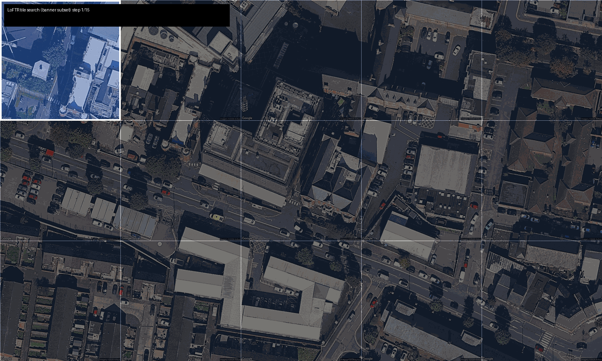
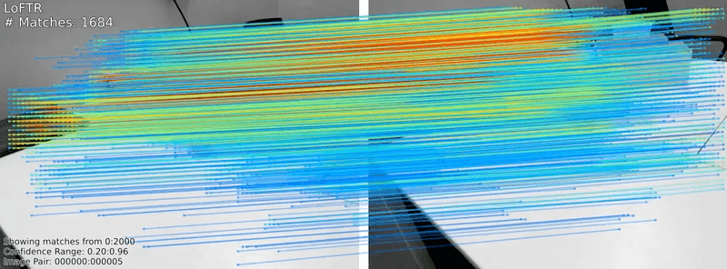
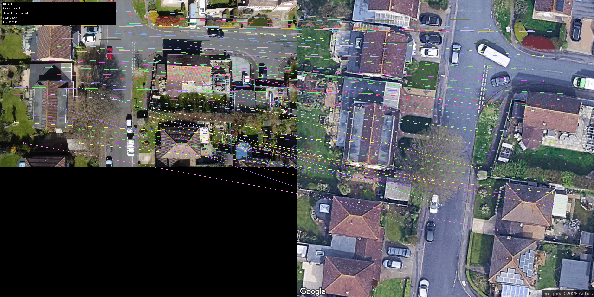
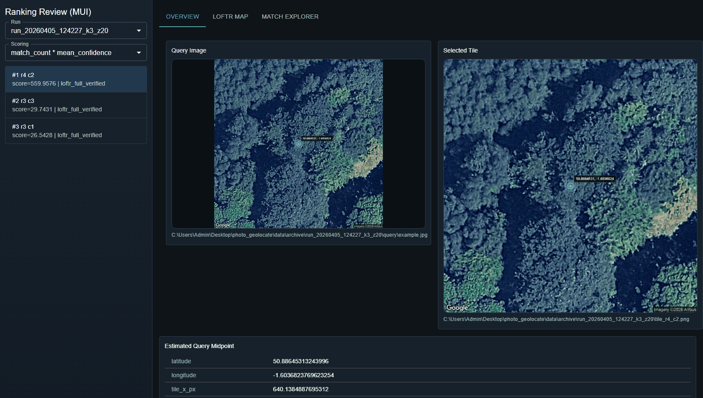

# Drone Photo Geolocate

<p align="center">
  
</p>

>> "If I have a drone, a rough known location, a camera, and a set of reference map tiles, can I recover my precise location in the absence of GPS?" 

This project geolocates a nadir drone query image by matching it against Google Maps tiles and extracting an estimated location. It is designed to run on edge compute.

## Table of Contents
1. [Quick Start](#quick-start)
2. [Project Description](#project-description)
3. [Using the GUI](#using-the-gui)
4. [Get The Code](#get-the-code)
5. [Linux/macOS Details](#linuxmacos-details)
6. [Configure + Run Pipeline](#configure--run-pipeline)
7. [Pipeline CLI Reference](#pipeline-cli-reference)
8. [Troubleshooting](#troubleshooting)

## Quick Start

1. Setup (PowerShell):

```powershell
git clone https://github.com/mdwasserman/drone_photo_geolocate.git
cd drone_photo_geolocate
py -3.10 -m venv .venv
.venv\Scripts\Activate.ps1
python -m pip install --upgrade pip
pip install -r requirements.txt
$env:GOOGLE_MAPS_API_KEY="YOUR_KEY_HERE"
$env:PYTHONPATH="src"
```

2. Configure:

Edit `configs/search_area.current.yaml`:
- `query.image`
- `prior_location.latitude`
- `prior_location.longitude`
- `search.radius_meters`
- `google_maps_api_key` (or keep `env:GOOGLE_MAPS_API_KEY`)

3. Run Pipeline:

```powershell
python -m photo_geolocate.run_pipeline --config configs/search_area.current.yaml --radius-m <RADIUS_M> --zoom 20 --shortlist-k 3 --scoring-mode match_count_mean_confidence --loftr-branch raw --out-dir data/archive
```

4. Launch Review GUI:

```powershell
python -m photo_geolocate.run_review_mui_app --out-dir data/archive --runs-root data/archive --host 127.0.0.1 --port 8770
```

Open `http://127.0.0.1:8770`.

## Project Description

The project pulls Google Maps tiles (online or cache) around a radius from an input location. It then uses [LoFTR](https://zju3dv.github.io/loftr/) to find the best tile match for a query image and estimate the true location. LoFTR outperformed the initial SuperPoint + SuperGlue implementation.


<sub>LoFTR in action</sub>

### Requirements

- Python 3.10+ (3.10/3.11 recommended)
- Google Static Maps key (config `google_maps_api_key` or env `GOOGLE_MAPS_API_KEY`)

### Gotchas To Avoid
This project is the product of many experiments involving different pipelines, models, and parameter combinations. The current setup has been tested against a range of input images. If you experiment further, remember that you are trying to make LoFTR's job as easy as possible:

- Use `flight_height.py` to estimate an appropriate flight height for your drone and sensor.
- Use zoom 20 tiles. Zoom 19 performance is less established.
- Try and get a clear nadir shot. The same geography can look markedly different from various angles.
- Try and avoid downsampling images. In tests here, information loss increased matching failures.
- An image could fall acorss multiple tiles, which can causing matching issues, so use the GUI to debug.

The project originally contained a coarse first pass, but those models did not reliably select the correct fine-stage tile.

### Run Time
Compute time increases non-linearly with search radius. Where possible, use GPU compute. On CPU, with 256x192 LoFTR input images, a 100m-radius search on will be done in ~30 seconds. 

### What Success Looks Like



## Using the GUI

There are two examples in the archive folder that will allow you to explore the functionality in the model and  GUI. They are trivial examples which use a Google Maps tile as an input, which therefore offers trivially performant matching. The project itself was tested on a range of real drone images for robustness. 

The GUI has three tabs. 

1. **Overview**. This tab shows the winning match and predicted location. It also allows you to select between different runs in the `/Archive` folder. 
2. **LoFTR Map**. This tab shows a heatmap of scores across all tiles in the search area.
3. **Match Explorer**. This tab allows an in-depth investigation of the matches between the query and the winning tile.

<p align="center">
  
</p>


## Linux/macOS Details

```bash
python3 -m venv .venv
source .venv/bin/activate
python -m pip install --upgrade pip
pip install -r requirements.txt
```

Set API key for current shell session:

```bash
export GOOGLE_MAPS_API_KEY="YOUR_KEY_HERE"
```

Set import path for this shell session:

```bash
export PYTHONPATH=src
```

## Configure + Run Pipeline

1. Put your query image in `data/input/` (example: `data/input/example.jpg`).
2. Update `configs/search_area.current.yaml`:
   - `google_maps_api_key` (literal key, `env:VAR_NAME`, or `${VAR_NAME}`)
   - `query.image`
   - `query.drone_altitude_m`
   - `query.camera.*`
   - `prior_location.latitude`
   - `prior_location.longitude`
   - `search.radius_meters`
3. Run:

```bash
PYTHONPATH=src python -m photo_geolocate.run_pipeline --config configs/search_area.current.yaml --radius-m <RADIUS_M> --zoom 20 --shortlist-k 3 --scoring-mode match_count_mean_confidence --no-reuse-cached-tiles --loftr-branch raw --out-dir data/archive
```

4. Launch Review GUI:

```bash
python -m photo_geolocate.run_review_mui_app --out-dir data/archive --runs-root data/archive --host 127.0.0.1 --port 8770
```

Open `http://127.0.0.1:8770`.

## Pipeline CLI Reference

- `--config <PATH>`: YAML config file path.
  - Example: `configs/search_area.current.yaml`
- `--center-lat <FLOAT>`: search center latitude (optional; defaults to `prior_location.latitude` in config).
  - Example: `50.8514293`
- `--center-lon <FLOAT>`: search center longitude (optional; defaults to `prior_location.longitude` in config).
  - Example: `-0.951431`
- `--radius-m <FLOAT>`: search radius in meters.
  - If omitted, uses `search.radius_meters` from config.
  - Example: `1000`
- `--zoom <INT>`: map zoom level.
  - Default: `20`
  - Typical: `18`, `19`, `20`
- `--shortlist-k <INT|all|0>`: number of top tiles for shortlist stage.
  - Default: `3`
  - `all` or `0` means every tile.
  - Examples: `3`, `15`, `all`
- `--scoring-mode <VALUE>`: final ranking score source.
  - Values: `match_count_mean_confidence`, `inlier_count_mean_confidence`
  - Default: `match_count_mean_confidence`
- `--loftr-branch <VALUE>`: LoFTR branch mode.
  - Values: `raw`, `structure`, `both`
  - Default: `both`
  - Fastest: `raw`
- `--loftr-input-size <WIDTHxHEIGHT>`: LoFTR processor input size.
  - Default: `640x480`
  - Format: `WIDTHxHEIGHT` (minimum parser limit: `160x120`)
  - Practical tested minimum in this repo: `256x192`
  - Examples: `256x192`, `640x480`
- `--disable-ransac`: disable RANSAC homography/inlier estimation.
- `--skip-match-visualizations`: skip expensive match image rendering.
- `--out-dir <PATH>`: output root directory.
  - Default: `data/archive`
- `--fixed-out-dir`: write directly into `--out-dir` instead of creating a new timestamped run folder.
- `--reuse-cached-tiles` / `--no-reuse-cached-tiles`: reuse existing tile downloads for same center/radius/zoom or force fresh fetch.
  - Default: reuse enabled

Outputs are written to a new run folder in `data/archive/` and include:
- staged query image (`query/`)
- fetched tiles
- `winner.json`
- `tile_match_summary.json`
- `interactive_diagnostics.json`
- visualizations

## Troubleshooting

- If you see `ModuleNotFoundError: No module named 'photo_geolocate'`, set `PYTHONPATH` first in that terminal:

```powershell
$env:PYTHONPATH="src"
```

```bash
export PYTHONPATH=src
```
```bash
export PYTHONPATH=src
```


- If GUI/API calls fail unexpectedly, confirm the run folder contains:
  - `winner.json`
  - `index.json`
  - `tile_match_summary.json`
